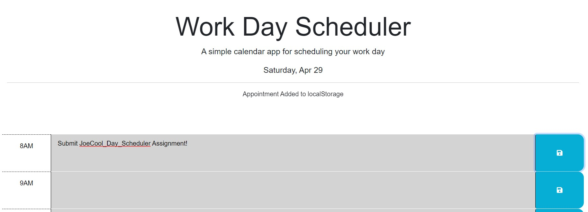

# JoeCool_Day_Scheduler

## Description

As part of week 5 challenge, I'm tasked with providing a day scheduler that will save user inputs to the local storage and provide certian visual queues based on the time of day througout the day.  

## Installation

No installation is required. This is a web based tool and can be accessed through [JoeCool_Day_Scheduler](https://joecool-engineer.github.io/JoeCool_Day_Scheduler/).

## Usage

Visit the [JoeCool_Day_Scheduler](https://joecool-engineer.github.io/JoeCool_Day_Scheduler/) and click on the **"Save Icon"** once a task/appointment has been entered. This will begin display text at the header to notify user the task/appointment has been saved to the local storage.

## Credits

The main page and styling was provided by University of Arizona coding bootcamp. However, the functionality was provided by JoeCool himself. Enjoy!

## Badges

